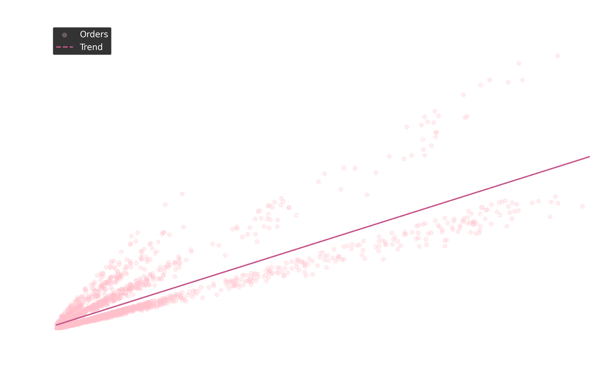
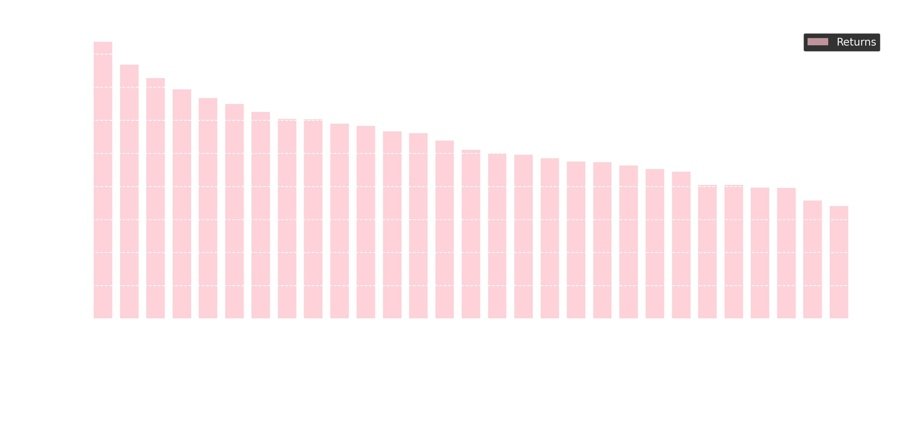

## 📈 Visuals

<table>
  <tr>
    <td></td>
    <td></td>
  </tr>
</table>

## 📊 Metrics

- `count`
- `mean`
- `median`
- `variance`
- `q50`
- `quartiles`
- `revenue`
- `revenue_discnt`
- `orders_count`
- `avg_check`
- `return_rate`
- `avg_rating`
- `last_order_date`
- `days_from_last_order`
- `revenue_by_category`
- `return_rate_by_category`
- `return_rate_by_city`
- `avg_delivery_days_by_city`
- `max_revenue_value`
- `revenue_values_over_200`
- `correlation`
